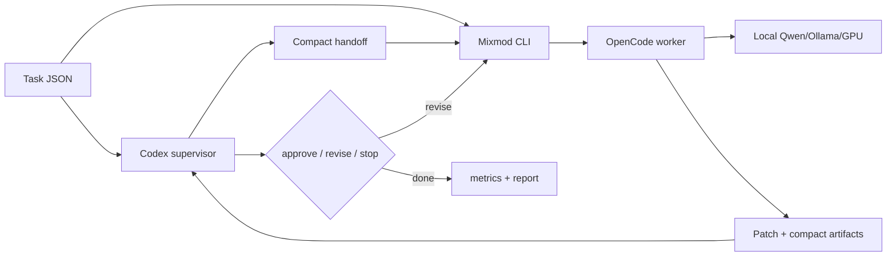

# Mixmod

Mixmod is an experimental CLI harness for testing whether Codex can spend fewer
frontier tokens by supervising a local GPU-backed coding worker.

The default strategy is:

1. Codex reads the task and emits a compact worker handoff.
2. Mixmod passes the original task plus handoff to local OpenCode/Qwen.
3. Codex reviews compact artifacts and asks the worker to revise, approves, or
   stops the loop.



## Benchmark Highlights

All runs below use selected SWE-bench Lite pools, not random samples. The main
question is whether Mixmod preserves official patch quality while reducing
frontier-token usage.

| Benchmark | Date | Pool | Official resolved | Frontier output | Total frontier tokens | Runtime | Notes |
| --- | --- | ---: | ---: | ---: | ---: | ---: | --- |
| [Current default 10-instance](docs/swebench-current-default-v1-10.md) | 2026-07-01 | 10 | 10/10 -> 10/10 | -51.4% | -75.5% | 3.8x slower | Latest snapshot; local Qwen/GPU verified on every Mixmod run. |
| [Current default 3-instance](docs/swebench-current-default-v1.md) | 2026-07-01 | 3 | 3/3 -> 3/3 | -53.1% | -74.0% | n/a | Same current strategy on the original selected pool. |
| [Explicit gpt-5.5/high rerun](docs/swebench-explicit-gpt55-high-v1.md) | 2026-06-30 | 3 | 3/3 -> 2/3 | -79.3% | -90.8% | 1.7x slower | Token savings held, but one Mixmod arm produced an empty patch. |
| [Codex-pass pilot](docs/swebench-codex-pass-pool-v1.md) | 2026-06-30 | 3 | 3/3 -> 3/3 | -85.4% | -91.1% | 1.3x slower | Earlier pilot; Codex reasoning effort was not pinned. |

Latest headline result: on the 10-instance selected pool, Codex-only and Mixmod
both resolved 10/10, while Mixmod reduced frontier output tokens from 54,407 to
26,469 and total frontier tokens from 4,642,623 to 1,137,724.

## Quick Start

```sh
cargo build
make check
target/debug/mixmod init
target/debug/mixmod status
```

Run one delegated task:

```sh
target/debug/mixmod delegate \
  --task example.task.json \
  --out .mixmod/runs/example \
  --require-local
```

Run an experiment:

```sh
target/debug/mixmod experiment init checkout-brief --fixture fixtures/python-checkout
target/debug/mixmod experiment record-codex-only checkout-brief \
  --task .mixmod/experiments/checkout-brief/task.json
target/debug/mixmod experiment run-default checkout-brief --require-local
target/debug/mixmod experiment report checkout-brief
```

## Local Integration

Mixmod keeps integration repo-local:

- generated state lives under `.mixmod/`
- repo-local Codex integration lives under `.codex/`
- OpenCode defaults to `local-ollama/qwen3.6:27b`
- global Codex and OpenCode config are not modified

Useful commands:

```sh
target/debug/mixmod init
target/debug/mixmod status
target/debug/mixmod doctor
target/debug/mixmod uninstall
```

## Artifacts

Each worker run writes compact artifacts for Codex review:

```text
receipt.json
report.md
changes.patch
tests.json
metrics.json
logs/
```

Default-strategy experiments also write `worker-brief.json`,
`frontier-feedback.jsonl`, `final.patch`, and an experiment `report.md`.
