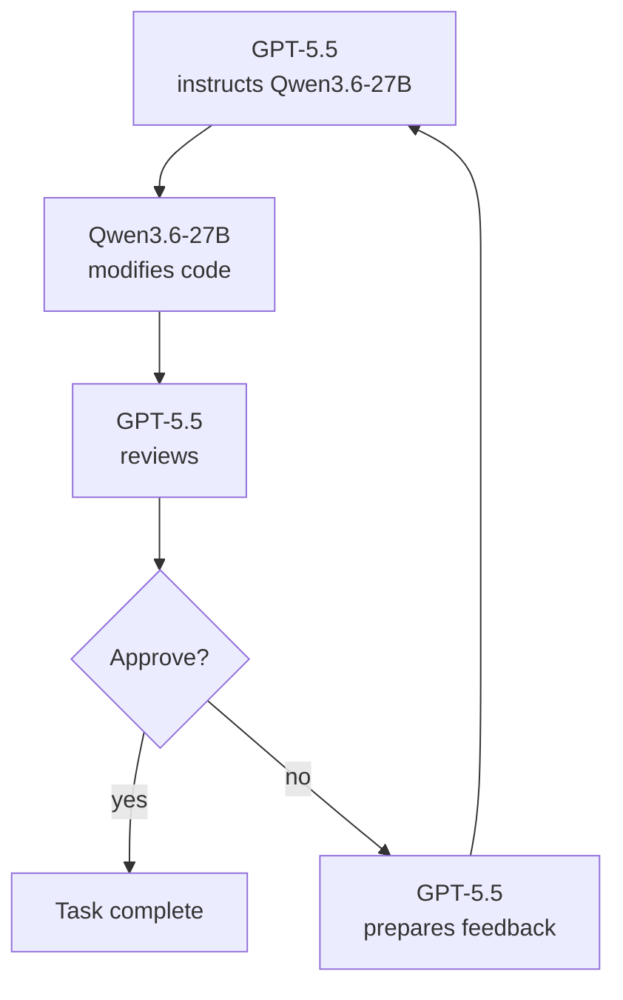

# Mixmod

Mixmod is an experimental LLM harness for reducing frontier LLM token usage.

It tests whether a strong frontier model can supervise a cheaper local model while preserving result quality. The current benchmarked pairing is GPT-5.5 supervising Qwen3.6-27B on a single RTX 3090.

Early benchmark results show a **75.5% aggregate reduction in GPT-5.5 token usage** on the latest 10-instance SWE-bench Lite pool:

* Output tokens fell by 51.4%.
* Input tokens fell by 76.1%.
* Per-instance total token reductions ranged from 56.0% to 91.4%.



## Latest Benchmark Highlights

Latest report: [SWE-bench current default 10-instance snapshot](docs/latest-benchmark.md).
This is a selected SWE-bench Lite pool where GPT-5.5 could solve every task. Mixmod is testing token reduction, not capability improvement.

This table shows the per-task reduction in GPT-5.5 tokens when using Mixmod instead of running GPT-5.5 alone.

| Benchmark | GPT-5.5 input tokens | GPT-5.5 output tokens |
| --- | ---: | ---: |
| `pytest-dev__pytest-11143` | -86.4% | -65.6% |
| `scikit-learn__scikit-learn-13439` | -66.0% | -37.9% |
| `sympy__sympy-20212` | -66.4% | -48.5% |
| `django__django-12908` | -56.3% | -43.6% |
| `pytest-dev__pytest-6116` | -81.4% | -56.2% |
| `django__django-13447` | -91.9% | -73.1% |
| `django__django-15814` | -84.5% | -61.5% |
| `django__django-11179` | -70.0% | -22.0% |
| `sympy__sympy-13480` | -64.8% | -60.6% |
| `scikit-learn__scikit-learn-13584` | -73.7% | -34.9% |

Mixmod reduced GPT-5.5 output tokens by 51.4% and total GPT-5.5 tokens by 75.5%, with local Qwen/GPU inference verified on every Mixmod run.

See the full benchmark report [docs/latest-benchmark.md](docs/latest-benchmark.md) for methodology, per-run details, runtime results, and caveats.

## Quick Start

Requirements: Codex and OpenCode.

```sh
cargo install mixmod
mixmod exec --task task.json --out .mixmod/runs/example --require-local
```
