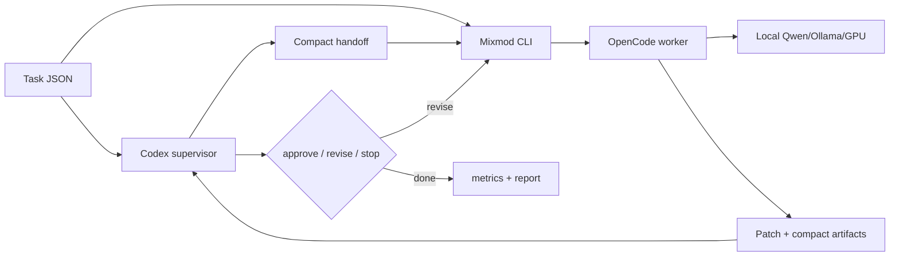

# Mixmod

Mixmod is an experimental CLI harness for testing whether Codex can spend fewer
frontier tokens by supervising a local GPU-backed coding worker.

The default strategy is:

1. Codex reads the task and emits a compact worker handoff.
2. Mixmod passes the original task plus handoff to local OpenCode/Qwen.
3. Codex reviews compact artifacts and asks the worker to revise, approves, or
   stops the loop.



## Latest Benchmark Highlights

Latest report: [SWE-bench current default 10-instance snapshot](docs/swebench-current-default-v1-10.md).
This is a selected Codex-pass SWE-bench Lite pool, not a random sample.

| Benchmark | Frontier input | Frontier output | Total frontier tokens | Runtime |
| --- | ---: | ---: | ---: | ---: |
| `pytest-dev__pytest-11143` | -86.4% | -65.6% | -86.0% | 1.9x slower |
| `scikit-learn__scikit-learn-13439` | -66.0% | -37.9% | -65.1% | 5.1x slower |
| `sympy__sympy-20212` | -66.4% | -48.5% | -66.1% | 1.5x slower |
| `django__django-12908` | -56.3% | -43.6% | -56.0% | 3.3x slower |
| `pytest-dev__pytest-6116` | -81.4% | -56.2% | -80.7% | 5.5x slower |
| `django__django-13447` | -91.9% | -73.1% | -91.4% | 1.6x slower |
| `django__django-15814` | -84.5% | -61.5% | -83.9% | 2.2x slower |
| `django__django-11179` | -70.0% | -22.0% | -68.8% | 11.0x slower |
| `sympy__sympy-13480` | -64.8% | -60.6% | -64.5% | 1.3x slower |
| `scikit-learn__scikit-learn-13584` | -73.7% | -34.9% | -72.8% | 4.8x slower |

Aggregate result: Codex-only and Mixmod both resolved 10/10. Mixmod reduced
frontier output tokens by 51.4% and total frontier tokens by 75.5%, with local
Qwen/GPU inference verified on every Mixmod run. The tradeoff was runtime:
Mixmod took 85.7 minutes versus 22.8 minutes for Codex-only.

## Quick Start

```sh
cargo build
make check
target/debug/mixmod init
target/debug/mixmod status
```

Run one delegated task:

```sh
target/debug/mixmod delegate \
  --task example.task.json \
  --out .mixmod/runs/example \
  --require-local
```

Run an experiment:

```sh
target/debug/mixmod experiment init checkout-brief --fixture fixtures/python-checkout
target/debug/mixmod experiment record-codex-only checkout-brief \
  --task .mixmod/experiments/checkout-brief/task.json
target/debug/mixmod experiment run-default checkout-brief --require-local
target/debug/mixmod experiment report checkout-brief
```
